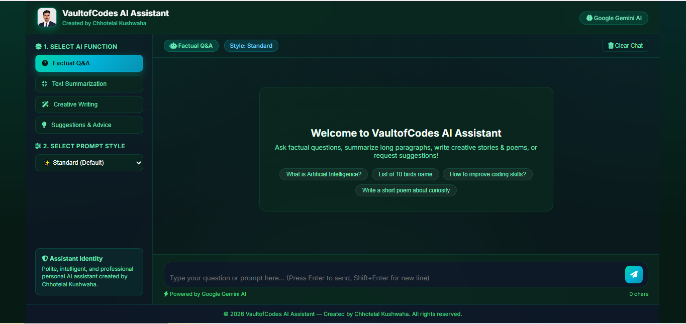

# 🚀 VaultofCodes Web AI Assistant



**Developer & Creator:** Chhotelal Kushwaha  
**Technology Stack:** Python 3, Flask, Google Gemini AI API, HTML5, CSS3 (Dark Glassmorphism), JavaScript (ES6+), Highlight.js, Marked.js

---

## 📌 Project Overview

The **VaultofCodes Web AI Assistant** is a clean, modern, lightweight web-based AI application powered by **Google Gemini AI**. The application is designed to solve four core tasks required for college project evaluation:

1. **Factual Question Answering**: Answers complex queries, science, technology, geography, and general knowledge questions in real time.
2. **Text Summarization**: Distills lengthy essays, reports, and articles into executive bullet points, one-sentence TL;DRs, or structured section breakdowns.
3. **Creative Writing**: Crafts engaging fiction short stories, rhyming poetry, speeches, sci-fi concepts, and essays.
4. **Suggestions & Advice**: Provides practical step-by-step roadmaps, motivational coaching, and decision-making matrices.

---

## 🛠️ Project Directory Structure

```
Assignment 3(Project)/
├── app.py                      # Flask Application Entry Point
├── config.py                   # Environment & Configuration Settings
├── requirements.txt            # Lightweight Web Dependencies
├── .env                        # Environment Variables (GEMINI_API_KEY)
├── README.md                   # Project Documentation & User Manual
│
├── routes/
│   └── chat.py                 # Flask Blueprint (Index Page & API Endpoints)
│
├── services/
│   └── gemini_service.py       # Google Gemini API & Live LLM Connector
│
├── utils/
│   └── prompt_templates.py     # Persona System Prompts, 4 Functions & Styles
│
├── templates/
│   └── index.html              # Modern Dark Glassmorphic Web UI
│
└── static/
    ├── css/
    │   └── style.css           # Dark Theme, Responsive Layout, Glassmorphism
    └── js/
        └── app.js              # Chat Stream, Markdown, Copy Code & Auto-scroll
```

---

## 🎯 Supported Functions & Prompt Engineering Styles

### 1. AI Functions
- 🧠 **Factual Q&A**: Real-time factual knowledge retrieval.
- 📝 **Text Summarization**: Concise executive summaries.
- 🎨 **Creative Writing**: Short stories, poems, sci-fi plot hooks, essays.
- 💡 **Suggestions & Advice**: Exam preparation, career strategies, productivity hacks.

### 2. Prompt Engineering Style Variations
- **Standard (Default)**: Balanced, natural markdown output.
- **Simple Language**: Clear, easy-to-understand explanations.
- **ELI5 (Explain Like I'm 10)**: Beginner-friendly analogies.
- **Bullet Points**: Skimmable, structured takeaways.
- **Professional Executive**: Business-oriented formal tone.

---

## ⚙️ Quickstart & Local Installation

### 1. Prerequisites
Ensure Python 3.9+ is installed on your system.

### 2. Install Dependencies
```bash
pip install -r requirements.txt
```

### 3. Environment Configuration
Ensure your `.env` file contains your **GEMINI_API_KEY**:
```env
GEMINI_API_KEY="your_api_key_here"
```

### 4. Run Application
```bash
python app.py
```

Open your browser and navigate to: **`http://127.0.0.1:5000`**

---

## 👨‍💻 Author
**Chhotelal Kushwaha** — Full-Stack Developer & Prompt Engineer
